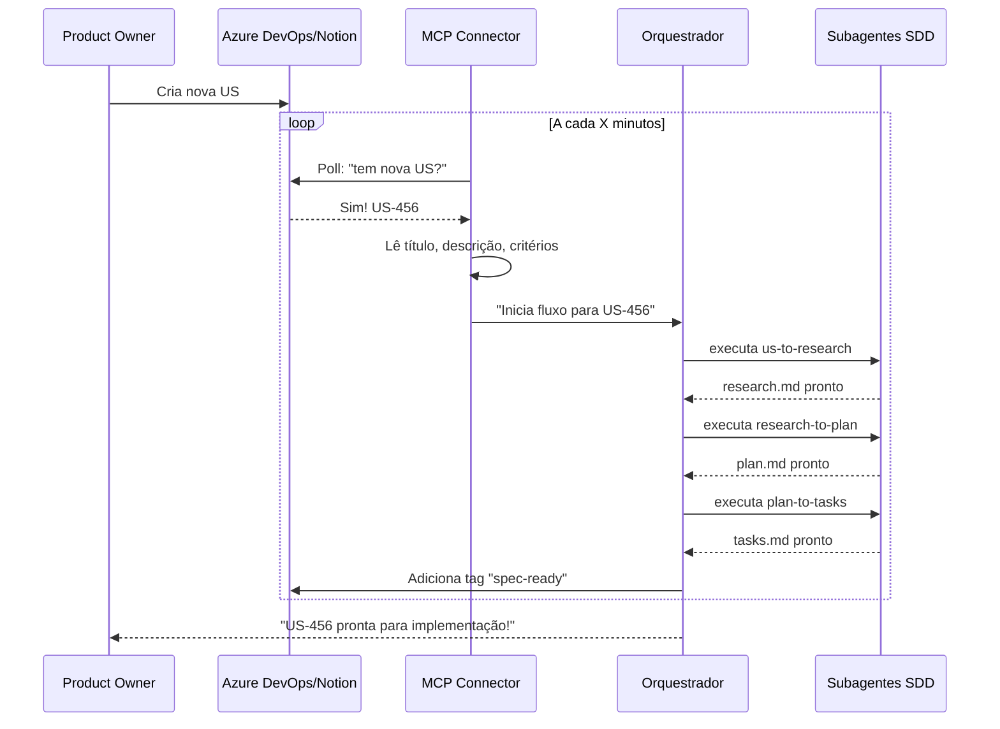

# 🚀 VisãoSpec — Projeto de Automação do Fluxo SDD

> **Este documento apresenta a visão de expansão do Spec-Driven Development para o time.**
> 
> *Escrito para que qualquer desenvolvedor — do jr ao sênior — entenda o poder desta transformação.*

---

## O Que Tem Hoje vs. O Que Vem Ai

| 🚩 Hoje (Manual) | 🔥 Amanhã (Automatizado) |
|------------------|--------------------------|
| Você copia a US do Azure DevOps/Notion | Um MCP lê o backlog e inicia o processo |
| Você verifica padrões no código manualmente | Um agente faz **drift detection** antes do commit |
| Você escreve testes depois do código | Um agente aplica **TDD** automaticamente |
| Você roda lint/typecheck na mão | Agentes verificam **em cada etapa** |
| Code review só no PR | Um agente **analisa na pipeline** |
| Você aprende com seus próprios erros | O sistema **aprende com TODOS** do time |

---

## 🏗️ Arquitetura da Visão — Diagrama Geral

```
┌──────────────────────────────────────────────────────────────────────────────────────┐
│                           ECOSSISTEMA SPEC-DRIVEN AUTO                              │
│                                                                                       │
│  ┌────────────────┐         ┌──────────────────────────────────────────────────┐   │
│  │   BACKLOG      │         │                    ORQUESTRADOR                   │   │
│  │  Azure DevOps  │         │   (Coordenador central que conecta tudo)          │   │
│  │     ou         │         │                                                   │   │
│  │    Notion      │         └───────────────────────┬──────────────────────────┘   │
│  └───────┬────────┘                                 │                              │
│          │                                          │                              │
│          │  MCP Connection                          ▼                              │
│          │                    ┌─────────────────────────────────────────────┐     │
│          │                    │            FLUXO AUTOMATIZADO               │     │
│          │                    │                                              │     │
│          │                    │  ┌─────────┐  ┌─────────┐  ┌─────────┐     │     │
│          │                    │  │   US    │─►│ RESEARCH│─►│  PLAN   │     │     │
│          │                    │  │(lida do │  │(gerado) │  │(gerado) │     │     │
│          │                    │  │backlog) │  │         │  │         │     │     │
│          │                    │  └─────────┘  └─────────┘  └────┬────┘     │     │
│          │                    │                                   │          │     │
│          │                    │                                   ▼          │     │
│          │                    │  ┌──────────────────────────────────────┐   │     │
│          │                    │  │         TASKS + TDD                 │   │     │
│          │                    │  │  ┌────────────────────────────────┐ │   │     │
│          │                    │  │  │  Subagente TDD                 │ │   │     │
│          │                    │  │  │  → Escreve teste PRIMEIRO       │ │   │     │
│          │                    │  │  │  → Implementa código            │ │   │     │
│          │                    │  │  │  → Executa teste                │ │   │     │
│          │                    │  │  └────────────────────────────────┘ │   │     │
│          │                    │  └──────────────────────────────────────┘   │     │
│          │                    │                      │                      │     │
│          │                    │                      ▼                      │     │
│          │                    │  ┌──────────────────────────────────────┐   │     │
│          │                    │  │         DRIFT DETECTION             │   │     │
│          │                    │  │  ┌────────────────────────────────┐ │   │     │
│          │                    │  │  │  Subagente Verificação         │ │   │     │
│          │                    │  │  │  → Padrões do projeto?        │ │   │     │
│          │                    │  │  │  → Convenções de código?       │ │   │     │
│          │                    │  │  │  → Tipagem TypeScript?         │ │   │     │
│          │                    │  │  │  → Regras de arquitetura?      │ │   │     │
│          │                    │  │  └────────────────────────────────┘ │   │     │
│          │                    │  └──────────────────────────────────────┘   │     │
│          │                    │                      │                      │     │
│          │                    │                      ▼                      │     │
│          │                    │  ┌──────────────────────────────────────┐   │     │
│          │                    │  │         LINT + TYPECHECK             │   │     │
│          │                    │  │  ┌────────────┐ ┌────────────────┐  │   │     │
│          │                    │  │  │   ESLint   │ │   TypeScript  │  │   │     │
│          │                    │  │  │  (código)  │ │   (tipos)     │  │   │     │
│          │                    │  │  └────────────┘ └────────────────┘  │   │     │
│          │                    │  └──────────────────────────────────────┘   │     │
│          │                    │                      │                      │     │
│          │                    │                      ▼                      │     │
│          │                    │  ┌──────────────────────────────────────┐   │     │
│          │                    │  │         COMMIT ATÔMICO                │   │     │
│          │                    │  │  Conventional Commits + Progress      │   │     │
│          │                    │  └──────────────────────────────────────┘   │     │
│          │                    └─────────────────────────────────────────────┘     │
│          │                                          │                              │
│          │                                          ▼                              │
│          │                    ┌─────────────────────────────────────────────┐     │
│          │                    │              PIPELINE CI/CD                  │     │
│          │                    │  ┌─────────────────────────────────────────┐│     │
│          │                    │  │         SUBAGENTE CODE REVIEW            ││     │
│          │                    │  │  → Analisa PR automaticamente            ││     │
│          │                    │  │  → Verifica padrões do projeto          ││     │
│          │                    │  │  → Sugere melhorias                     ││     │
│          │                    │  │  → Flagga issues de segurança           ││     │
│          │                    │  └─────────────────────────────────────────┘│     │
│          │                    └─────────────────────────────────────────────┘     │
│          │                                          │                              │
│          └──────────────────────────────────────────┴──────────────────────────────┘
│                                                     │                                   │
│                                                     ▼                                   │
│  ┌─────────────────────────────────────────────────────────────────────────────┐    │
│  │                     LOOP DE APRENDIZADO CONTÍNUO                            │    │
│  │                                                                              │    │
│  │   ┌─────────────┐     ┌─────────────┐     ┌─────────────┐                   │    │
│  │   │  Revisão    │────►│  Coleta de  │────►│   Feedback │                   │    │
│  │   │  Humana     │     │   Dados     │     │  Processado│                   │    │
│  │   └─────────────┘     └─────────────┘     └──────┬──────┘                   │    │
│  │        ▲                                            │                        │    │
│  │        │           ┌───────────────────────────────┘                        │    │
│  │        │           │                                                        │    │
│  │        │           ▼                                                        │    │
│  │        │    ┌──────────────────────────────────┐                             │    │
│  │        │    │      MELHORA CONTÍNUA            │                             │    │
│  │        │    │  → Padrões se atualizam          │                             │    │
│  │        └────│  → Agentes aprendem              │◄────────────────────────┘    │
│  │             │  → Documentação evolui            │                             │
│  │             └──────────────────────────────────┘                             │    │
│  └─────────────────────────────────────────────────────────────────────────────┘    │
│                                                                                       │
└──────────────────────────────────────────────────────────────────────────────────────┘

 Legenda: 
 ───► Fluxo de dados      ────► Feedback/Loop
```

---

## 🔌 1. MCP de Backlog — O Ponto de Partida Automático

### O Problema Hoje
```
Você: "Preciso implementar o botão de login"
1. Abre Azure DevOps ou Notion
2. Copia o título da US
3. Copia a descrição
4. Entra no terminal
5. Pede para o agente gerar o research
```

### A Solução Amanhã
```
Sistema: (monitore o backlog a cada X minutos)
1. Detecta nova US no Azure DevOps/Notion
2. Lê automaticamente: título, descrição, critérios de aceite
3. Inicia o fluxo: us-to-research → research-to-plan → plan-to-tasks
4. Notifica você: "Pronto! Tasks geradas para US-123"
5. Você só precisa executar!
```

### Diagrama de Sequência



### Benefícios
| Para o Time | Para o Dev |
|-------------|------------|
| Menos retrabalho por mal-entendido | Não precisa copiar/colar manualmente |
| US mais bem escritas (o MCP cobraclaridade) | Já começa com tudo pronto |
| Rastreabilidade automática | Foca no que importa: CODIFICAR |

---

## 🕵️ 2. Subagente Drift Detection — O Guardião dos Padrões

### O Que É "Drift"?
> **Drift** = quando o código vai se afastando dos padrões originais, lentamente, como um rio que muda de curso.

### Como Funciona

```
ANTES DE CADA COMMIT:
┌─────────────────────────────────────────────────────────────┐
│                    DRIFT DETECTION                           │
├─────────────────────────────────────────────────────────────┤
│                                                              │
│   Seu código ──► Agente verifica:                           │
│                     ✅ Nomes de arquivos corretos?          │
│                     ✅ Estrutura de pastas?                 │
│                     ✅ Padrões de componentes?              │
│                     ✅ Tipos exportados?                     │
│                     ✅ Props seguindo convenção?            │
│                     ✅ Tailwind classes válidas?            │
│                                                              │
│   Se algo errado:                                           │
│      ❌ BLOQUEIA o commit                                   │
│      📝 Explica O QUE está errado                           │
│      💡 Sugere COMO corrigir                                │
│                                                              │
└─────────────────────────────────────────────────────────────┘
```

### Cenário Prático

```
🚫 Commit BLOQUEADO

Drift Detection diz:
─────────────────────────────────────────
🔴 ARQUIVO: src/components/button/btn.tsx

Problemas encontrados:
1. Nome de arquivo diferente do padrão
   → Esperado: button.tsx
   → Encontrado: btn.tsx
   
2. Props não segue a convenção do projeto
   → O projeto usa Interface (ButtonProps)
   → Este arquivo usa type

3. Estilo inline detectado
   → Evite style={{}}
   → Use classes Tailwind
─────────────────────────────────────────

Corrja e tente novamente!
```

### Integração com Git Hooks

```bash
# .git/hooks/pre-commit
#!/bin/bash
npx @spec-driven/drift-detection

# Se retornar erro, o commit é bloqueado
```

---

## 🧪 3. Subagente TDD — Testes Primeiro

### O Problema Hoje
1. Você escreve código
2. (Às vezes) escreve teste depois
3. Teste quebra → você conserta
4. Entrega e reza para não quebrar em produção

### A Solução Amanhã
```
CADA TASK VEM COM TDD:
┌─────────────────────────────────────────────────────────────┐
│                  SUBAGENTE TDD                              │
├─────────────────────────────────────────────────────────────┤
│                                                              │
│   Task: "Criar componente Button"                          │
│                                                              │
│   1. Lê os critérios de aceite da task                    │
│   2. Escreve testes ANTES de qualquer implementação        │
│      → Testes que FALHAM (vermelho)                        │
│   3. Você implementa o código                               │
│   4. Testes passam (verde)                                  │
│   5. Refatora se necessário                                  │
│   6. Commit!                                                │
│                                                              │
└─────────────────────────────────────────────────────────────┘
```

### Exemplo Visual

```
FASE 1: Teste First (vermelho)
─────────────────────────────────────────
test('Button renderiza com texto', () => {
  render(<Button>Clique aqui</Button>)
  expect(screen.getByText('Clique aqui')).toBeInTheDocument()
})
// ❌ FAIL - Button não existe ainda!
─────────────────────────────────────────

FASE 2: Implementação (verde)
─────────────────────────────────────────
export function Button({ children }: ButtonProps) {
  return <button>{children}</button>
}
// ✅ PASS - Teste passa!
─────────────────────────────────────────

FASE 3: Refatoração (opcional)
─────────────────────────────────────────
export function Button({ children, variant = 'primary' }: ButtonProps) {
  return <button className={variant}>{children}</button>
}
// ✅ Still PASS!
─────────────────────────────────────────
```

### Benefícios para Devs Juniores

| Benefício | Como Ajuda Você |
|-----------|----------------|
| Testes cobrem o que importa | Não fica perdido no que testar |
| Confiança para refatorar | Mude sem medo de quebrar |
| Documentação viva | Teste = especificação executável |
| Bug menor | Encontra erro antes de commitar |

---

## 🔍 4. Subagente Lint + Typecheck — O Verificador Automático

### O Fluxo

```
┌─────────────────────────────────────────────────────────────┐
│                 PIPELINE DE VERIFICAÇÃO                     │
│                                                              │
│   Código ──► TypeScript ──► ESLint ──► Commit              │
│              (tipos)      (estilo)                          │
│                                                              │
│   Se ERRO em qualquer etapa:                               │
│      ❌ Commit BLOQUEADO                                     │
│      📝 Mostrar linha e coluna                             │
│      💡 Explicar a regra violada                            │
│                                                              │
└─────────────────────────────────────────────────────────────┘
```

### Regras Customizadas do Projeto

O subagente também verifica regras específicas do Spec-Driven:

```
Verificações Spec-Driven:
─────────────────────────────────────────
✅ Componente tem arquivo de tipos?
✅ Interface segue nomenclatura XxxProps?
✅ Estilo usa Tailwind (não inline)?
✅ Props tem documentação JSDoc?
✅ Variáveis seguem camelCase?
✅ Arquivo exporta o que promete?
─────────────────────────────────────────
```

---

## 📋 5. Subagente Code Review na Pipeline

### O Fluxo do PR

```
┌─────────────────────────────────────────────────────────────┐
│                    GITHUB ACTIONS                           │
├─────────────────────────────────────────────────────────────┤
│                                                              │
│   PR Aberto ──► CI Roda ──► Code Review Bot ──► Resultado  │
│                    │           │                             │
│                    │           └──► Análise automática:     │
│                    │                • Padrões respeitados?  │
│                    │                • Código duplicado?      │
│                    │                • Complexidade alta?     │
│                    │                • Segurança?            │
│                    │                • Performance?           │
│                    │                • Boas práticas?         │
│                    │                                          │
│                    ▼                                          │
│              Se tudo ok: ✅ PR aprovado                      │
│              Se problemas: ❌ PR com comments                │
│                                                              │
└─────────────────────────────────────────────────────────────┘
```

### Exemplo de Review Automático

```
🤖 Code Review Bot — Análise Automática

Reviewed by: Spec-Driven Review Agent

ARQUIVO: src/components/button/button.tsx

📝 SUGESTÕES:

1. Linha 15: Prop não utilizada
   → Remova `unusedProp` ou use `_unusedProp`

2. Linha 23: Complexidade alta (12)
   → Considere extrair lógica para hook

3. Linha 31: Use Object.freeze para constantes
   → Evita mutação acidental

📊 MÉTRICAS:
   • Cobertura de testes: 85%
   • Complexidade: Média
   • Duplicação: 0%

✅ APROVADO com sugestões
```

---

## 🔄 6. Loop de Aprendizado Contínuo — O Cérebro Coletivo

### A Grande Sacada

> **Nenhum desenvolvedor trabalha sozinho. Por que a IA deveria?**

### Como Funciona

```
┌─────────────────────────────────────────────────────────────┐
│              ECOSSISTEMA DE APRENDIZADO                     │
│                                                              │
│   ┌─────────────┐     ┌─────────────┐     ┌─────────────┐ │
│   │   Dev faz   │────►│  Sistema    │────►│  Padrões    │ │
│   │   revisão   │     │  coleta     │     │  evoluem    │ │
│   │  humana     │     │  feedback   │     │             │ │
│   └─────────────┘     └─────────────┘     └──────┬──────┘ │
│        ▲                                         │         │
│        │                                         ▼         │
│        │          ┌─────────────┐     ┌─────────────────┐ │
│        └──────────│  Agentes    │◄────│  Base de        │ │
│                   │  melhoram   │     │  conhecimento    │ │
│                   └─────────────┘     └─────────────────┘ │
│                                                              │
└─────────────────────────────────────────────────────────────┘
```

### Coleta de Dados

Cada revisão humana alimenta o sistema:

| Tipo de Feedback | O Que Acontece |
|------------------|----------------|
| "Esse nome de variável está confuso" | Agente aprende nova convenção |
| "Esse teste poderia cover mais casos" | TDD agent melhora estratégia |
| "Esse padrão não faz sentido aqui" | Drift detection afina regras |
| "Esse código tem segurança" | Code review aprende com você |

### Evolução Natural

```
Mês 1: Sistema aprende básicos
         → Nomes de arquivos
         → Estrutura de pastas
         → Convenções básicas

Mês 3: Sistema entende contexto
         → Quando usar hook vs componente
         → Quando refatorar
         → Padrões específicos do projeto

Mês 6: Sistema antecipa problemas
         → Sugere melhorias antes de você errar
         → Conhece as armadilhas comuns
         → Aprende com TODOS os devs do time
```

---

## 🌐 7. Analytics-to-Design — Do Dado à Tela Automática

### O Cenário

Imagine que você pode **criar novas telas automaticamente** com base no comportamento real dos usuários do seu site. Isso não é mais ficção científica — é o próximo nível do ecossistema Spec-Driven.

### Como Funciona

```
┌─────────────────────────────────────────────────────────────────────────────────────┐
│                  ANALYTICS-TO-DESIGN PIPELINE                                        │
│                                                                                      │
│  ┌────────────────┐    ┌────────────────┐    ┌────────────────┐                   │
│  │  Google        │    │    Hotjar      │    │   Dados        │                   │
│  │  Analytics     │    │    (sessions)  │    │   Customizados │                   │
│  └───────┬────────┘    └───────┬────────┘    └───────┬────────┘                   │
│          │                      │                     │                             │
│          └──────────────────────┼─────────────────────┘                             │
│                                 │                                                   │
│                                 ▼                                                   │
│                    ┌─────────────────────────────┐                                    │
│                    │   AGENTE DE INSIGHTS       │                                    │
│                    │  ┌───────────────────────┐ │                                    │
│                    │  │ → Pageviews por rota  │ │                                    │
│                    │  │ → Tempo em cada tela  │ │                                    │
│                    │  │ → Cliques mais comuns │ │                                    │
│                    │  │ → Onde usuários saem  │ │                                    │
│                    │  │ → Padrões de scroll  │ │                                    │
│                    │  │ → Dispositivo usado   │ │                                    │
│                    │  └───────────────────────┘ │                                    │
│                    └─────────────┬─────────────┘                                    │
│                                  │                                                  │
│                                  ▼                                                  │
│                    ┌─────────────────────────────┐                                    │
│                    │   ANALISADOR DE PADROES    │                                    │
│                    │  ┌───────────────────────┐ │                                    │
│                    │  │ "60% dos usuários     │ │                                    │
│                    │  │  passam 3s na página  │ │                                    │
│                    │  │  de pricing"          │ │                                    │
│                    │  │                       │ │                                    │
│                    │  │ "Usuários de mobile   │ │                                    │
│                    │  │  saem no checkout"    │ │                                    │
│                    │  │                       │ │                                    │
│                    │  │ "Botão CTA tem 2%     │ │                                    │
│                    │  │  de clique"           │ │                                    │
│                    │  └───────────────────────┘ │                                    │
│                    └─────────────┬─────────────┘                                    │
│                                  │                                                  │
│                                  ▼                                                  │
│                    ┌─────────────────────────────┐                                    │
│                    │   GERADOR DE CENÁRIOS       │                                    │
│                    │  ┌───────────────────────┐ │                                    │
│                    │  │ → Criar versão        │ │                                    │
│                    │  │   simplificada mobile │ │                                    │
│                    │  │ → Adicionar sociais   │ │                                    │
│                    │  │   no pricing          │ │                                    │
│                    │  │ → Novo CTA mais      │ │                                    │
│                    │  │   visível             │ │                                    │
│                    │  └───────────────────────┘ │                                    │
│                    └─────────────┬─────────────┘                                    │
│                                  │                                                  │
│                                  ▼                                                  │
│                    ┌─────────────────────────────┐                                    │
│                    │   MCP PUSH TO DESIGN       │                                    │
│                    │  ┌───────────────────────┐ │                                    │
│                    │  │ → Gera proposal no   │ │                                    │
│                    │  │   Pencil automaticamente│                                  │
│                    │  │ → Designer recebe   │ │                                    │
│                    │  │   notificação         │ │                                    │
│                    │  │ → Revisa e approve  │ │                                    │
│                    │  └───────────────────────┘ │                                    │
│                    └─────────────┬─────────────┘                                    │
│                                  │                                                  │
│                                  ▼                                                  │
│                    ┌─────────────────────────────┐                                    │
│                    │   IMPORTA PARA CÓDIGO      │                                    │
│                    │  ┌───────────────────────┐ │                                    │
│                    │  │ → import-design       │ │                                    │
│                    │  │ → Aplica no código   │ │                                    │
│                    │  └───────────────────────┘ │                                    │
│                    └─────────────────────────────┘                                    │
└─────────────────────────────────────────────────────────────────────────────────────┘
```

### Exemplo Prático

```
CENÁRIO REAL:
================

1. Analytics detecta:
   "60% dos usuários mobile abandona a página de pricing 
    após 2 segundos. O botão de upgrade está abaixo do fold."

2. Agente gera cenário:
   "Criar versão mobile-first da página de pricing 
    com botão CTA fixo no bottom bar"

3. Push para Design (via MCP):
   → Gera proposal no Pencil automaticamente
   → Designer recebe: "Nova proposta baseada em dados"

4. Designer revisa e ajusta:
   → Approva ou faz ajustes no Pencil

5. Código atualiza automaticamente:
   → import-design-to-code aplica as mudanças
   → Nova versão em produção!

RESULTADO: 
- Página otimizada para mobile
- Baseada em dados REAIS de comportamento
- Em horas, não semanas
```

### Fontes de Dados Suportadas

| Ferramenta | Dados Coletados |
|------------|-----------------|
| **Google Analytics 4** | Pageviews, eventos, conversões, audience |
| **Hotjar** | Heatmaps, session recordings, funnels |
| **Mixpanel** | Eventos customizados, cohorts |
| **Amplitude** | Product analytics, retention |
| **Dados próprios** | APIs internas, planilhas |

### Benefícios

| Para o Negócio | Para o Design | Para o Dev |
|----------------|---------------|------------|
| Decisões baseadas em dados | Não precisa adivinhar | Não guessing de requirements |
| Velocidade 10x maior | Foca em qualidade criativa | Já tem protótipo pronto |
| Conversão real aumenta | Proposal validada | Menos retrabalho |
| ROI mensurável | Clareza do que mudar | Código alinhado com UX |

### O Ciclo Completo

```
┌─────────────────────────────────────────────────────────────────────┐
│                    CICLO COMPLETO: DADO → DESIGN → CÓDIGO           │
├─────────────────────────────────────────────────────────────────────┤
│                                                                      │
│   📊 COLETA          🎨 DESIGN              💻 DESENVOLVIMENTO       │
│   ─────────          ──────                ───────────────          │
│                                                                      │
│   GA + Hotjar ─────► Proposal Pencil ────► Código React ──────►    │
│      │                    │                      │                  │
│      │                    │                      │                  │
│      │              Designer approve          Pipeline CI           │
│      │                    │                      │                  │
│      │                    ◄──────────────────────┘                  │
│      │                    │                                         │
│      │                    │ Feedback loop                          │
│      │                    ▼                                         │
│      │              Analytics atualiza                             │
│      │                    │                                         │
│      └────────────────────┘                                         │
│                                                                      │
│   Ciclo contínuo: a cada iteração, o sistema aprende mais          │
│                                                                      │
└─────────────────────────────────────────────────────────────────────┘
```

---

## 🚀 8. Integração Total — O Ecossistema Conectado

### Visão Unificada

```
┌─────────────────────────────────────────────────────────────────────────────────────┐
│                    ECOSSISTEMA SPEC-DRIVEN COMPLETO                                  │
│                                                                                      │
│                                                                                      │
│    ┌──────────────────────────────────────────────────────────────────────────┐     │
│    │                         FLUXO DE DESENVOLVIMENTO                         │     │
│    │                                                                           │     │
│    │   BACKLOG ──► RESEARCH ──► PLAN ──► TASKS ──► TDD ──► CODE ──► PR     │     │
│    │     │                                                                      │     │
│    │     │         MCP (Azure DevOps/Notion)                                    │     │
│    │     │         Automa entrada de trabalho                                    │     │
│    │     │                                                                      │     │
│    │     └──────────────────────────────────────────────────────────────────────┘     │
│    │                                    │                                        │
│    ▼                                    ▼                                        │
│  ┌──────────────────────────────────────────────────────────────────────────────┐   │
│  │                      FLUXO DE QUALIDADE                                     │   │
│  │                                                                           │   │
│  │   DRIFT DETECTION ──► LINT ──► TYPECHECK ──► CODE REVIEW ──► MERGE    │   │
│  │        │                                                                    │   │
│  │        │         Git Hooks + Pipeline CI                                    │   │
│  │        │         Verificação automática                                    │   │
│  │        └──────────────────────────────────────────────────────────────────┘   │
│  │                                    │                                        │
│  ▼                                    ▼                                        │
│  ┌──────────────────────────────────────────────────────────────────────────────┐   │
│  │                      FLUXO DE INSIGHTS                                     │   │
│  │                                                                           │   │
│  │   ANALYTICS ──► INSIGHTS ──► CENÁRIOS ──► DESIGN (MCP) ──► CÓDIGO     │   │
│  │      │                                                                  │   │
│  │      │         Google Analytics + Hotjar + mais                          │   │
│  │      │         Dados de uso REAIS                                         │   │
│  │      └──────────────────────────────────────────────────────────────────┘   │
│  │                                    │                                        │
│  ▼                                    ▼                                        │
│  ┌──────────────────────────────────────────────────────────────────────────────┐   │
│  │                    LOOP DE APRENDIZADO CONTÍNUO                             │   │
│  │                                                                           │   │
│  │   Revisão Humana ──► Feedback ──► Padrões Evoluem ──► Agentes Melhora   │   │
│  │                                                                           │   │
│  └──────────────────────────────────────────────────────────────────────────────┘   │
│                                                                                      │
└─────────────────────────────────────────────────────────────────────────────────────┘
```

### Três Pilares, Um Objetivo

| Pilar | Função | Ferramentas |
|-------|--------|-------------|
| **🚀 Desenvolvimento** | Do backlog ao código | MCP, us-to-research, TDD, implement-tasks |
| **🛡️ Qualidade** | Padrões garantidos | Drift Detection, Lint, Typecheck, Code Review |
| **📊 Evolução** | Dados → Decisões | Analytics, Insights, MCP Design Push |

---

## 🎯 Benefícios para Cada Pessoa do Time

### Para Devs Juniores
```
✅ Não fica perdido — o processo guia passo a passo
✅ Aprende com exemplos — testes, código e reviews
✅ Erros são pegos cedo — não precisa ter medo
✅ Cresce mais rápido — absorve conhecimento do time via IA
```

### Para Devs Plenos
```
✅ Foca no que importa — código de valor
✅ Menos revisões manuais — sistema ajuda
✅ Mantém padrões — sem precisar lembrar de tudo
✅ Ajuda juniors — o sistema multiplica seu conhecimento
```

### Para Devs Seniores
```
✅ Arquitetura evolui — conhecimento capturado
✅ Menos retrabalho — padrões mantidos automaticamente
✅ Onboarding mais rápido — novos devs aprendem com o sistema
✅ Foco em decisões estratégicas — código repetitivo automatizado
```

### Para Product Owners
```
✅ US mais claras — MCP exige especificidade
✅ Entregas mais previsíveis — fluxo padronizado
✅ Menos mal-entendidos — tudo rastreável
✅ Feedback rápido — sistema mostra progresso
✅ Decisões baseadas em dados — não mais guessing
✅ Velocidade 10x — do insight à produção em horas
```

### Para Designers
```
✅ Não trabalham no escuro — dados guiam decisões
✅ Proposals automáticas — MCP gera draft no Pencil
✅ Foco em qualidade criativa — não em versões base
✅ Validação instantânea — feedback do código é automático
✅ Ciclo reduzido — iterar em horas, não semanas
```

### Para Times de Produto
```
✅ Produto evolui baseado em comportamento real
✅ Conversão aumenta — decisões orientadas por dados
✅ Zero atrito entre design e dev — tudo conectado
✅ Entregas contínuas — pipeline sempre rodando
```

---

## 🚦 Roadmap de Implementação

```
FASE 1: Fundações (Semana 1-2)
├── MCP Azure DevOps/Notion
│   └── Lê backlog automaticamente
├── Configuração de Git Hooks
│   └── Pre-commit com verificações
└── Subagente TDD básico
    └── Escreve teste antes do código

FASE 2: Automação (Semana 3-4)
├── Drift Detection
│   └── Verifica padrões antes de commit
├── Lint + Typecheck integrado
│   └── Pipeline de verificação
└── Progresso e métricas

FASE 3: Inteligência (Semana 5-6)
├── Code Review na pipeline
│   └── Análise automática de PRs
├── Loop de aprendizado
│   └── Coleta feedback humano
└── Dashboard de métricas

FASE 4: Analytics-to-Design (Semana 7-8)
├── Integração Google Analytics API
│   └── Coleta de métricas
├── Integração Hotjar
│   └── Heatmaps e sessions
├── Agente de Insights
│   └── Gera cenários automaticamente
└── MCP Push to Design
    └── Gera proposals no Pencil

FASE 5: Evolução (Semana 9+)
├── Agentes especializados por domínio
├── Previsão de problemas
├── Base de conhecimento growing
└── Ciclos contínuos de melhoria
```

---

## 💪 Por Que Este Projeto Vai Decolar?

| Desafio | Nossa Solução |
|---------|---------------|
| "É muito trabalho manual" | Automação total do fluxo |
| "Sempre esqueço de rodar testes" | Agentes fazem por você |
| "Código fica inconsistente" | Drift detection garante padrões |
| "Review leva tempo" | Pipeline analiza automaticamente |
| "Juniores demoram para aprender" | Sistema ensina passo a passo |
| "Conhecimento fica na cabeça de cada um" | Base de conhecimento coletiva |

---

## 🤝 Próximos Passos

Para começar esta jornada:

1. **Apresentar esta visão ao time** ✅ (você está aqui!)
2. **Validar Interesse** → Todo mundo topa contribuir?
3. **Priorizar Features** → Qual traz mais valor primeiro?
4. **Criar First Spike** → Uma pequena prova de conceito
5. **Iterar e Melhorar** → Evoluir conforme feedback

---

## Perguntas? Dúvidas?

> "Isso não vai substituir nosso trabalho — vai nos POTENCIALIZAR."

**A IA não substitui desenvolvedores. Desenvolvedores que usam IA substituem os que não usam.**

---

*Visão criada em: 2026-03-15*
*Documento vivo — evolui com o feedback do time*
