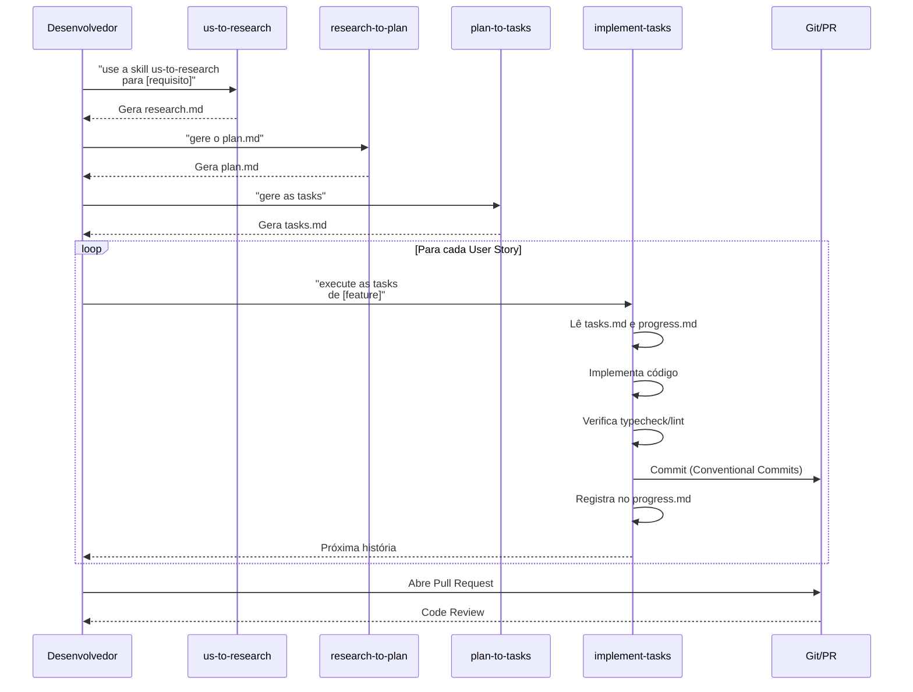
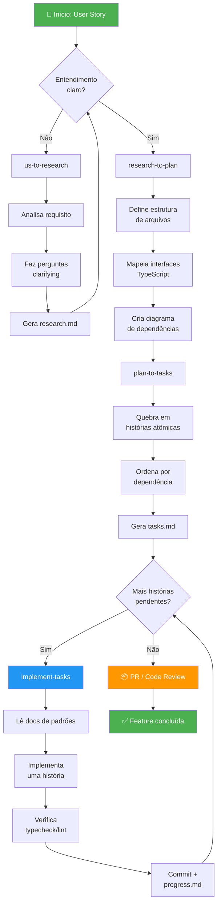
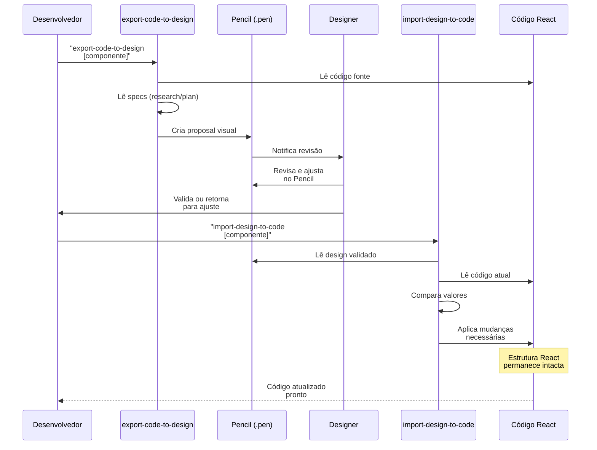
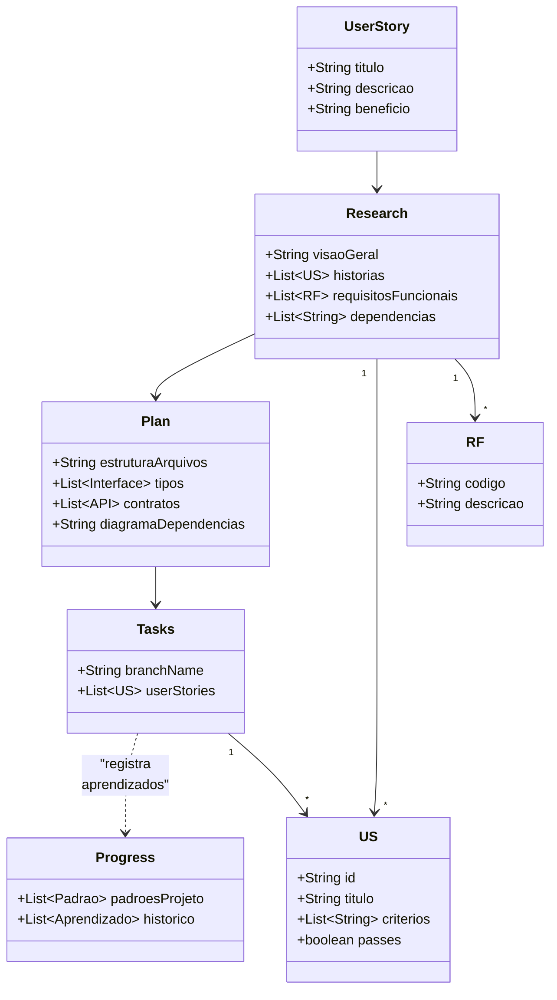

# Guia do Fluxo de Trabalho — Spec-Driven Development

> **Bem-vindo ao time!** Este documento vai te mostrar como trabalhamos aqui, passo a passo, de forma simples e direta. Leia com atenção e qualquer dúvida, é só perguntar. 🚀

---

## Por Que Seguimos Este Processo?

Antes de tudo, vamos entender **o porquê** de tudo isso. Você pode estar pensando: "Puxa, parece complicateado! Por que não simplesmente escrever código direto?"

### A resposta simples

Este processo existe para te **ajudar** a ser um desenvolvedor melhor:

| Problema Sem Este Processo | Como O Processo Resolve |
|---------------------------|------------------------|
| "Não sei por onde começar" | Cada etapa diz exatamente o que fazer |
| "Fico preso sem saber o próximo passo" | Os subagentes guiam cada fase |
| "Código fica inconsistente" | Padrões documentados e verificados |
| "Design e código ficam desencontrados" | Sincronização bidirecional automática |
| "Tenho medo de errar" | Critérios de aceitação claros e verificáveis |
| "Não sei o que já foi feito" | Tudo documentado e rastreável |

> **Você não está sozinho neste processo.** Os agentes IA trabalham como seus **pares de programação** — eles fazem o trabalho pesado enquanto você aprende e toma as decisões importantes.

---

## 📊 Diagramas do Fluxo de Trabalho

### Diagrama de Sequência — Desenvolvimento Principal



### Diagrama de Atividade — Fluxo Completo



### Diagrama de Sequência — Sincronização Design ↔ Código



### Diagrama de Atividade — Worktree Runner (Paralelo)

```mermaid
flowchart LR
    subgraph Input
        A["🎯 Features:<br/>avatar, button, icon"]
    end
    
    subgraph Worktrees
        direction TB
        B1[spec-driven-ui-avatar<br/>branch: us/avatar]
        B2[spec-driven-ui-button<br/>branch: us/button]
        B3[spec-driven-ui-icon<br/>branch: us/icon]
    end
    
    subgraph Output
        C[Pronto para PR]
    end
    
    A -->|"worktree-runner<br/>avatar button icon"| B1
    A -->|"em paralelo"| B2
    A -->|""| B3
    
    B1 --> C
    B2 --> C
    B3 --> C
    
    style B1 fill:#9C27B0,color:#fff
    style B2 fill:#9C27B0,color:#fff
    style B3 fill:#9C27B0,color:#fff
```

### Diagrama de Classes — Artefatos por Etapa



---

## O Fluxo Completo — Do zero ao PR

```
┌─────────────────────────────────────────────────────────────────────────────────────┐
│                           FLUXO DE DESENVOLVIMENTO                                   │
│                                                                                      │
│   ┌─────────────┐    ┌─────────────┐    ┌─────────────┐    ┌─────────────┐         │
│   │   IDÉIA     │───►│  RESEARCH   │───►│    PLAN     │───►│   TASKS     │         │
│   │ (User Story)│    │  (Análise)  │    │ (Arquitetura│    │(Histórias)  │         │
│   └─────────────┘    └─────────────┘    └─────────────┘    └─────────────┘         │
│                                                                     │                 │
│                                                                     ▼                 │
│                                                            ┌─────────────┐          │
│                                                            │  IMPLEMENTA  │          │
│                                                            │    ÇÃO       │          │
│                                                            └─────────────┘          │
│                                                                     │                 │
│                                                                     ▼                 │
│                                                            ┌─────────────┐          │
│                                                            │     PR      │          │
│                                                            │ (Revisão)   │          │
│                                                            └─────────────┘          │
└─────────────────────────────────────────────────────────────────────────────────────┘
```

Vamos ver cada etapa em detalhes:

---

### 1. User Story (Idéia)

Tudo começa com uma **necessidade de negócio** ou **requisito do produto**. Pode vir de:
- Product Owner
- Cliente
- Você mesmo identificando uma melhoria

> **Exemplo:** "Preciso de um componente de botão que tenha variants (primary, secondary, ghost) e sizes (sm, md, lg)."

**Formato:** Use o formato padrão: `Como [usuário], eu quero [ação] para que [benefício]`

---

### 2. Research (us-to-research)

Este é o primeiro subagente que você vai usar. Ele transforma requisitos abstratos em um **documento estruturado de pesquisa**.

**Quando usar:**
```
"use a skill us-to-research para converter a US [sua descrição] para o research de desenvolvimento"
```

**O que este agente faz:**
- Analisa a User Story
- Faz perguntas clarifying (se necessário)
- Verifica dependências (outros componentes que precisam existir antes)
- Gera o `research.md` com todas as informações necessárias
- Identifica se a feature está **BLOQUEADA** por dependências

**Resultado:** `specs/features/[nome-da-feature]/research.md`

**O que você aprende:**
- Como transformar requisitos vagos em especificações técnicas
- Quais perguntas fazer antes de começar a codar
- Quais componentes já existem e podem ser reutilizados

---

### 3. Plan (research-to-plan)

Com o research aprovado, este agente transforma análise em **arquitetura técnica**.

**Quando usar:**
```
"gere o plan.md a partir do research de [nome-da-feature]"
```

**O que este agente faz:**
- Lê o research.md aprovado
- Define a estrutura de arquivos
- Mapeia interfaces TypeScript
- Desenha contratos de API
- Cria o diagrama de dependências
- Define props de componentes

**Resultado:** `specs/features/[nome-da-feature]/plan.md`

**O que você aprende:**
- Como arquitetar uma feature do zero
- Quais arquivos criar e em qual ordem
- Como definir tipos corretamente em TypeScript

---

### 4. Tasks (plan-to-tasks)

O plan-to-tasks transforma arquitetura em **histórias de usuário atômicas** — pequenas o suficiente para serem implementadas em uma única sessão.

**Quando use:**
```
"gere as tasks para [nome-da-feature]"
```

**O que este agente faz:**
- Lê research e plan
- Cria histórias tiny (US-001, US-002, etc.)
- Cada história é **completamente independente**
- Define critérios de aceitação **verificáveis**
- Determina a ordem de implementação (types → services → hooks → componentes → página)
- **Adiciona campo "Depende de:"** para enable paralelização

**Regras importantes que o agente segue:**
- **Cada história deve caber em uma iteração** (uma sessão de código)
- **Ordem importa:** nunca criar componente antes do type que ele usa
- **Critérios claros:** "Typecheck aprovado", "Verificar no navegador"

**Resultado:** `specs/features/[nome-da-feature]/tasks.md`

**O que você aprende:**
- Como quebrar funcionalidades grandes em partes gerenciáveis
- A importância de critérios de aceitação verificáveis
- Dependências entre diferentes partes do código

---

### 5. Implementação (implement-tasks)

Este é o momento de **codar de verdade**! O agente implementa cada história seguindo os padrões do projeto.

**Quando usar:**
```
"execute as tasks da feature [nome-da-feature]"
```

**O que este agente faz:**
- Lê o tasks.md e identifica a próxima história
- Lê o progress.md (histórico de implementações anteriores)
- Lê o plan.md para contexto técnico
- Lê os documentos globais de padrões (AGENTS.md, convenções, guardrails)
- Implementa APENAS o que está nos critérios de aceitação
- Commita seguindo Conventional Commits
- Registra aprendizados no progress.md
- Passa para a próxima história

**Resultado:** Código implementado + commits organizados + documentação atualizada

**O que você aprende:**
- Como escrever código que segue padrões estabelecidos
- A importância de commits atômicos e bem descritos
- Como documentar decisões para o futuro

---

### 6. Pull Request

Com todas as histórias implementadas, é hora de **revisar o código**.

**Checklist antes de abrir PR:**
- [ ] Todos os testes passam
- [ ] Typecheck Approved
- [ ] Lint Approved
- [ ] Código segue os padrões do projeto
- [ ] Progress.md foi destilado nos documentos gerais

---

## Sincronização Design ↔ Código

Um dos maiores problemas em projetos reais é **design e código ficarem desencontrados**. Aqui, resolvemos isso com uma **sincronização bidirecional** automatizada!

```
┌─────────────────────────────────────────────────────────────────┐
│                    SINCRONIZAÇÃO DESIGN ↔ CÓDIGO                │
│                                                                  │
│      DESIGN (.pen)                    CÓDIGO (React)            │
│          │                                  │                   │
│          │  1. export-code-to-design        │                   │
│          │  (envia para revisão)            │                   │
│          ▼                                  ▼                   │
│    ┌───────────┐                    ┌───────────┐              │
│    │ Proposal  │◄──────────────────►│   Código  │              │
│    │  (review) │  2. import-design   │  Atual    │              │
│    └───────────┘    (valida de volta)└───────────┘              │
│          │                                  │                   │
│          │    3. diff-design-vs-code         │                   │
│          └──────────────────────────────────┘                   │
│                      (compara e gera relatório)                │
└─────────────────────────────────────────────────────────────────┘
```

### Fluxo: Código → Design (Export)

Quando você quer propor algo visual para o design ou precisa de validação:

```
"use a skill export-code-to-design para [nome-do-componente]"
```

O agente:
1. Lê seu código
2. Lê as specs (research/plan)
3. Cria uma "proposal" no arquivo .pen do Pencil
4. O design revisa e ajusta se necessário

### Fluxo: Design → Código (Import)

Quando o design validou algo no Pencil e você precisa refletir no código:

```
"use a skill import-design-to-code para [nome-do-componente]"
```

O agente:
1. Lê o que foi validado no Pencil
2. Compara com o código atual
3. Aplica as mudanças necessárias
4. Mantém sua estrutura React intacta

### Comparando (Diff)

Para ver o que está diferente entre design e código:

```
"analise as alterações no design do pencil"
"use a skill diff-design-vs-code"
```

Gera um relatório bonito mostrando:
- ✅ SINCRONIZADOS — tudo certo
- ❌ DIVERGENTES — precisam de ajuste
- 🆕 NOVOS NO DESIGN — ainda não implementados
- 📦 NÃO IMPLEMENTADOS — especificado mas não feito

---

## Os Subagentes — Sua Equipe IA

Você não está trabalhando sozinho! Tem uma **equipe de agentes especializados** te ajudando:

| Agente | Função | Quando Usar |
|--------|--------|-------------|
| **us-to-research** | Converte requisito em análise | Precisa entender o que fazer |
| **research-to-plan** | Transforma análise em arquitetura | Já tem research aprovado |
| **plan-to-tasks** | Cria histórias pequenas | Já tem plan aprovado |
| **implement-tasks** | Executa o código | Já tem tasks aprovados |
| **tasks-parallel-analyzer** | Analisa tasks para paralelização | Quer otimizar execução com worktree-runner |
| **worktree-runner** | Roda múltiplas features em paralelo | Precisa implementar várias coisas ao mesmo tempo |
| **export-code-to-design** | Envia código para revisão visual | Quer propor algo ao design |
| **import-design-to-code** | Traz design validado para código | Design aprovou algo no Pencil |
| **diff-design-vs-code** | Compara design com código | Quer ver o que está diferente |
| **analyse-consistency** | Analisa qualidade dos artefatos | Quer verificar se tudo está coerente |

---

## Análise de Paralelização de Tasks

Quando você tem **múltiplas tasks** dentro de uma mesma feature, nem todas precisam ser executadas em sequência. O `tasks-parallel-analyzer` identifica quais tasks podem rodar em paralelo!

### Por que isso importa?

```
Sem paralelização:  US-001 → US-002 → US-003 → US-004 (4 rodadas)
Com paralelização:  US-001 → US-002,US-003 → US-004 (3 rodadas)
```

### Como usar:

**1. Gere as tasks normalmente:**
```
"gere as tasks para [nome-da-feature]"
```

**2. Analise a paralelização:**
```
"analise paralelização [nome-da-feature]"
```

**3. O agente retorna:**
```
=== Análise de Paralelização ===

Feature: icon
Total de Tasks: 2

📊 Grupos de Execução:

Group 1: US-001 (sem dependências)
    ↓
Group 2: US-002 (depende de: US-001)

💡 Sugestão: Execute US-001 primeiro, depois US-002
```

### Campo "Depende de:"

Para enable a paralelização, o `plan-to-tasks` adiciona automaticamente o campo **"Depende de:"** em cada história:

```markdown
### US-001: Criar tipos
**Artefatos:**
- Cria: `src/components/icon/icon.types.ts`
- Depende de: (nenhum)

### US-002: Criar componente
**Artefatos:**
- Cria: `src/components/icon/icon.tsx`
- Depende de: `US-001` (precisa dos tipos)
```

### Regras de dependência:

| Se cria | Dependem dele |
|---------|---------------|
| `types.ts` | Services, hooks, componentes |
| `*Service.ts` | Hooks e componentes |
| `use*.ts` | Componentes que usam o hook |
| `components/*.tsx` | Páginas que usam o componente |

---

## Worktree Runner — Desenvolvimento Paralelo

Precisa implementar **múltiplas features ao mesmo tempo**? O worktree-runner cria branches isoladas para cada uma!

**Quando usar:**
```
"rode [feature1], [feature2] em paralelo"
```

**O que acontece:**
1. Cria worktrees Git separados (um para cada feature)
2. Instala dependências em cada um
3. Executa as tasks de cada feature isoladamente
4. No final, você tem múltiplas branches prontas para PR

**Benefício:** Você pode trabalhar em Button e Avatar ao mesmo tempo sem um afectar o outro!

---

## Dicas de Ouro para Devs Juniores

### ✅ Faça

- **Leia os documentos primeiro** — AGENTS.md, convenções, guardrails. Tudo está lá para te ajudar.
- **Siga a ordem** — Não pule etapas. Research → Plan → Tasks → Implement é importante.
- **Faça perguntas** — Os agentes são seus parceiros. Se algo não está claro, peça esclarecimentos.
- **Verifique seu código** — Execute typecheck e lint antes de commitar.
- **Documente aprendizados** — O progress.md existe para isso. Registre o que descobrir.
- **Peça ajuda** — Este processo existe para te dar estrutura, não para te limitar.

### ❌ Não Faça

- **Não pule etapas** — "Ah, vou direto pro código" parece mais rápido, mas cria problemas depois.
- **Não ignore erros de lint/typecheck** — Esses erros são seus amigos, não inimigos.
- **Não commite código quebrado** — Se o CI está vermelho, arrume antes.
- **Não tenha medo de perguntar** — Pergunta besta é aquela que não foi feita.
- **Não assuma convenções** — Sempre leia os documentos de padrões antes de começar.

---

## Perguntas Frequentes

### "E se eu não souber usar algum desses agentes?"

É simples! É só pedirhelp: "como fazer X com o agente Y?" O agente te explica. Ou pergunte para um colega ou para mim — estou aqui para ajudar!

### "Posso pular alguma etapa se for algo pequeno?"

Para coisas muito simples (como corrigir um typo), você pode ir direto. Mas para qualquer feature, mesmo pequena, o processo completo garante qualidade e rastreabilidade. Confie no processo!

### "E se eu errar algo no código?"

Os agentes verificam typecheck e lint. Se algo estiver errado, você vai saber antes de commitar. E se algo passar e for descoberto depois, a revisão do PR vai pegar. Erros são aprendizado, não fracasso!

### "Posso contribuir para melhorar este processo?"

**ABSOLUTAMENTE SIM!** Este processo é vivo. Se você identificar algo que pode melhorar:
1. Documente a sugestão
2. Teste na prática
3. Compartilhe com o time

Juntos, fazemos este processo ficar melhor!

---

## Próximos Passos

1. **Leia os documentos de referência:**
   - `specs/docs/guardrails.md` — Regras obrigatórias
   - `specs/docs/convencoes-codigo.md` — Padrões de código
   - `specs/docs/padroes-git.md` — Como fazer commits

2. **Pratique com algo simples:**
   - Escolha uma feature pequena
   - Siga o fluxo completo
   - Veja como os agentes trabalham

3. **Peça ajuda quando precisar:**
   - Não sofra sozinho
   - Pergunte para o time
   - Use os agentes como parceiros

---

## Contato e Dúvidas

- Leia primeiro: `specs/docs/` — talvez sua dúvida já esteja respondida lá
- Pergunte no Slack/Discord do time
- Chame um colega mais experiente para fazer pair programming

---

**Agora você está pronto para contribuir!** 🚀

Este documento é vivo. Se algo mudar ou se você tiver sugestões, contribua para melhorá-lo!

---

*Última atualização: 2026-03-15*
